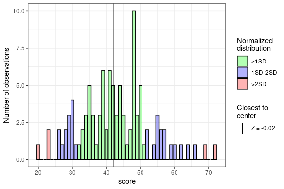
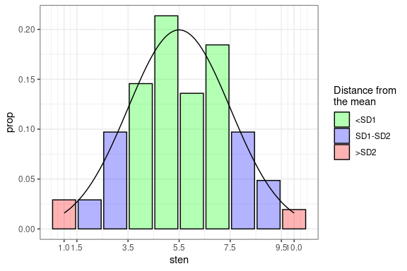
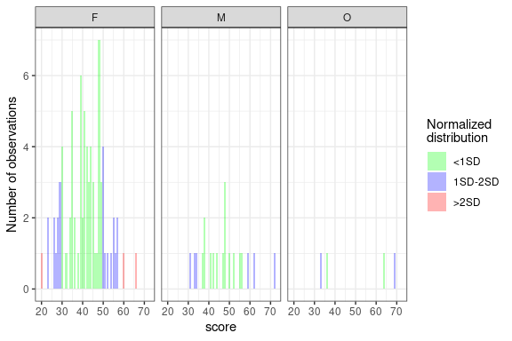
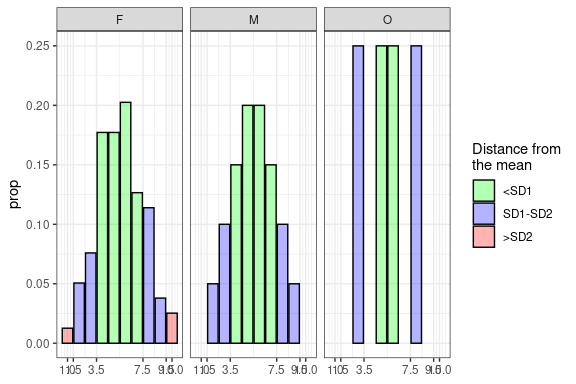

<!-- README.md is generated from README.Rmd. Please edit that file -->

# stenR 

<!-- badges: start -->

[](https://lifecycle.r-lib.org/articles/stages.html#experimental)
[](https://app.codecov.io/gh/StatisMike/stenR)
<!-- badges: end -->

`stenR` is a package tailored mainly for users and creators of
psychological questionnaires, though other social science researchers
and survey authors can benefit greatly from it.

It provides tools to help with processes necessary for conducting such
studies:

1.  processing data from raw item scores to raw factor/scale scores
2.  standardization of the raw scores into standard scale of your
    choosing, either by:
    -   normalization of the raw scores using frequency table (if no
        norms have been developed before). Usually for authors of
        questionnaires or their adaptations.
    -   importing scoring table developed by questionnaire authors - for
        researchers only using the measure

Furthermore, tools for developing or using norms on grouped basis are
also provided (up to two intertwined grouping conditions are supported).

Most in-depth information is provided within vignette **Tour from data
to results** (for basic and verbose explanation) and less verbose but
more complete in **stenR usage** vignette.

## Installation

You can install the current version from [GitHub](https://github.com/)
with:

``` r
# install.packages("devtools")
devtools::install_github("StatisMike/stenR")
```

## Usage

### Data processing

Process data from item raw scores to factor/scales scores

``` r
# Exemplary data provided within package
str(SLCS)
#> 'data.frame':    103 obs. of  19 variables:
#>  $ user_id: chr  "damaged_kiwi" "unilateralised_anglerfish" "technical_anemonecrab" "temperate_americancurl" ...
#>  $ sex    : chr  "M" "F" "F" "F" ...
#>  $ age    : int  30 31 22 26 22 17 27 24 20 19 ...
#>  $ SLCS_1 : int  4 5 4 5 5 5 5 4 4 5 ...
#>  $ SLCS_2 : int  2 2 4 3 2 3 1 5 2 1 ...
#>  $ SLCS_3 : int  1 2 4 2 3 1 1 4 1 2 ...
#>  $ SLCS_4 : int  2 1 4 2 4 2 1 4 4 2 ...
#>  $ SLCS_5 : int  2 2 4 1 2 2 2 4 2 2 ...
#>  $ SLCS_6 : int  4 4 5 5 5 5 1 2 5 4 ...
#>  $ SLCS_7 : int  4 4 4 5 3 5 2 3 5 3 ...
#>  $ SLCS_8 : int  4 5 4 5 4 5 5 4 4 5 ...
#>  $ SLCS_9 : int  2 3 2 1 3 1 1 4 1 1 ...
#>  $ SLCS_10: int  4 4 3 4 4 4 5 4 5 5 ...
#>  $ SLCS_11: int  1 1 2 1 1 2 1 3 1 1 ...
#>  $ SLCS_12: int  4 2 4 3 3 2 2 4 3 1 ...
#>  $ SLCS_13: int  4 5 5 4 3 4 4 4 5 5 ...
#>  $ SLCS_14: int  2 1 3 2 4 1 1 4 1 1 ...
#>  $ SLCS_15: int  5 4 4 4 4 3 3 2 5 4 ...
#>  $ SLCS_16: int  4 5 5 4 5 4 5 5 5 5 ...

# create scale specifications
SL_spec <- ScaleSpec(
  name = "Self-Liking",
  item_names = c("SLCS_1", "SLCS_3", "SLCS_5", "SLCS_6", "SLCS_7", 
                 "SLCS_9", "SLCS_11", "SLCS_15"),
  min = 1,
  max = 5,
  reverse = c("SLCS_1", "SLCS_6", "SLCS_7", "SLCS_15")
)

SC_spec <- ScaleSpec(
  name = "Self-Competence",
  item_names = c("SLCS_2", "SLCS_4", "SLCS_8", "SLCS_10", "SLCS_12",
                 "SLCS_13", "SLCS_14", "SLCS_16"),
  min = 1,
  max = 5,
  reverse = c("SLCS_8", "SLCS_10", "SLCS_13")
)

GS_spec <- CombScaleSpec(
  name = "General Score",
  SL_spec,
  SC_spec
)

# summarize data into factors/scales
summed_data <- sum_items_to_scale(
  data = SLCS,
  SL_spec,
  SC_spec,
  GS_spec,
  retain = c("user_id", "sex")
)

str(summed_data)
#> 'data.frame':    103 obs. of  5 variables:
#>  $ user_id        : chr  "damaged_kiwi" "unilateralised_anglerfish" "technical_anemonecrab" "temperate_americancurl" ...
#>  $ sex            : chr  "M" "F" "F" "F" ...
#>  $ Self-Liking    : int  13 15 19 10 16 12 18 28 10 14 ...
#>  $ Self-Competence: int  20 15 26 19 25 17 14 28 19 13 ...
#>  $ General Score  : int  33 30 45 29 41 29 32 56 29 27 ...
```

### Create *FrequencyTable*, *ScoreTable* for normalization

Generate norms from raw data to normalize and standardize results

``` r
GS_ft <- FrequencyTable(summed_data$`General Score`)
#> ℹ There are missing raw score values between minimum and maximum raw scores.
#>   They have been filled automatically.
#>   No. missing: 13/53 [24.53%]
plot(GS_ft)
```

<!-- -->

``` r
GS_st <- ScoreTable(GS_ft, scale = STEN)
plot(GS_st)
```

<!-- -->

``` r
normalized_GS <- normalize_score(
  summed_data$`General Score`,
  table = GS_st,
  what = "sten"
)

normalized_data <- normalize_scores_df(
  data = summed_data,
  vars = "General Score",
  GS_st,
  what = "sten",
  retain = c("user_id", "sex")
)

str(normalized_GS)
#>  num [1:103] 4 3 6 3 5 3 4 8 3 2 ...
str(normalized_data)
#> 'data.frame':    103 obs. of  3 variables:
#>  $ user_id      : chr  "damaged_kiwi" "unilateralised_anglerfish" "technical_anemonecrab" "temperate_americancurl" ...
#>  $ sex          : chr  "M" "F" "F" "F" ...
#>  $ General Score: num  4 3 6 3 5 3 4 8 3 2 ...
```

### Create *GroupedFrequencyTable* and *GroupedScoreTable*

Generate norms for different groups on basis of up to two
*GroupConditions* objects

``` r
sex_grouping <- GroupConditions(
  conditions_category = "Sex",
  "M" ~ sex == "M",
  "F" ~ sex == "F",
  "O" ~ sex == "O"
)

GS_gft <- GroupedFrequencyTable(
  data = summed_data,
  conditions = sex_grouping,
  var = "General Score",
  .all = FALSE
)
#> ℹ There are missing raw score values between minimum and maximum raw scores for
#>   some groups. They have been filled automatically.
#> • M No. missing: 25/42; 59.52%
#> • F No. missing: 15/47; 31.91%
#> • O No. missing: 33/37; 89.19%
plot(GS_gft)
```

<!-- -->

``` r
GS_gst <- GroupedScoreTable(GS_gft, scale = STEN)
plot(GS_gst)
```

<!-- -->

``` r
grouping_normalized <- normalize_scores_grouped(
  data = summed_data,
  vars = "General Score",
  GS_gst,
  retain = c("user_id", "sex"),
  what = "sten",
  group_col = "Group"
)

str(grouping_normalized)
#> Classes 'data.table' and 'data.frame':   103 obs. of  4 variables:
#>  $ Group        : chr  "M" "F" "F" "F" ...
#>  $ user_id      : chr  "damaged_kiwi" "unilateralised_anglerfish" "technical_anemonecrab" "temperate_americancurl" ...
#>  $ sex          : chr  "M" "F" "F" "F" ...
#>  $ General Score: num  3 4 6 3 5 3 4 9 3 3 ...
```

### Create and export *ScoringTable*

Export generated norms in universal format

``` r
ST_csv <- tempfile(fileext = ".csv")
GS_scoring <- to_ScoringTable(
  table = GS_gst,
  min_raw = 16,
  max_raw = 80
)

export_ScoringTable(
  table = GS_scoring,
  out_file = ST_csv,
  method = "csv"
)
#> Warning: <GroupConditions> haven't been exported. To export them with csv method, please
#> provide the `cond_file` argument
```

### Create *ScoringTable* from **csv** or **json** file

Import *ScoringTable* from universally readable formats (eg. create
**csv** on basis of published norms)

``` csv
"sten","M","F","O"
1,NA,"16-22",NA
2,"16-32","23-26",NA
3,"33-36","27-29","16-35"
4,"37-40","30-37",NA
5,"41-47","38-41","36-63"
6,"48-51","42-47","64-68"
7,"52-58","48-49",NA
8,"59-71","50-55","69-80"
9,"72-80","56-59",NA
10,NA,"60-80",NA
```

``` r
imported <- import_ScoringTable(
  source = ST_csv,
  method = "csv",
  conditions = sex_grouping
)

scoring_normalized <- normalize_scores_scoring(
  data = summed_data,
  vars = "General Score",
  imported,
  retain = c("user_id", "sex"),
  group_col = "Group"
)

str(scoring_normalized)
#> 'data.frame':    103 obs. of  4 variables:
#>  $ user_id      : chr  "damaged_kiwi" "unilateralised_anglerfish" "technical_anemonecrab" "temperate_americancurl" ...
#>  $ sex          : chr  "M" "F" "F" "F" ...
#>  $ Group        : chr  "M" "F" "F" "F" ...
#>  $ General Score: num  3 4 6 3 5 3 4 9 3 3 ...
```
